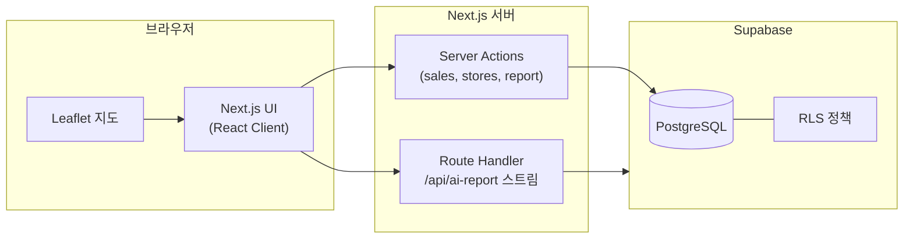
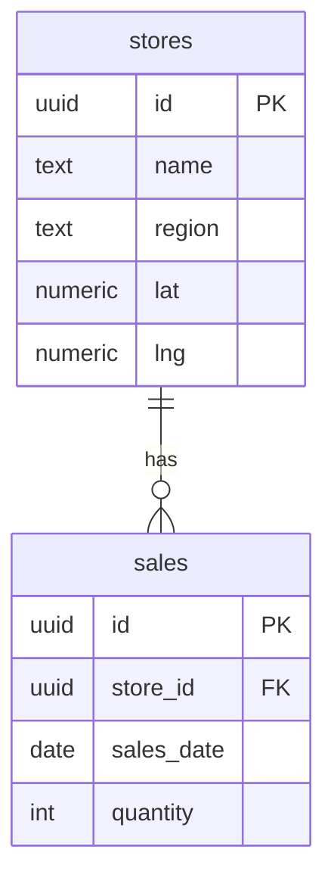

# 창조통닭 가맹점 지도 대시보드

Next.js(App Router) · Supabase · react-leaflet 기반 **지역별 판매·지점 관리** 대시보드입니다.

## 스크린샷

`docs/screenshots/` 에 이미지를 넣은 뒤 아래처럼 참조하세요 (제출 시 3~5장 권장).

| 파일명 (예시) | 내용 |
|----------------|------|
| `01-map-overview.png` | 메인 지도 + 사이드 패널 |
| `02-charts.png` | 기간별 추이·막대 차트 |
| `03-calendar.png` | 일별 캘린더 연동 |
| `04-ranking.png` | 랭킹·히트맵 (선택) |
| `05-csv-table.png` | CSV 다운로드 / 엑셀 붙여넣기 표 |

```markdown

```

## 주요 기능

- **관리자 로그인**: `/login`에서 번호 입력(httpOnly 쿠키, 7일). **`NODE_ENV=development`에서만** `ADMIN_ACCESS_CODE` 미설정 시 기본 `0000`. **프로덕션에서는 `ADMIN_ACCESS_CODE` 필수**(미설정 시 로그인 불가). 연속 실패 시 IP 기준 **rate limit**(인스턴스 메모리, 운영 시 Redis 등 권장).
- **지도**: 시·도별 색상 마커, 검색 매칭 강조, 동일 좌표 지점 겹침 완화(`mapMarkerSpread`)
- **기간 필터**: 전일 / 1주 / 1개월 / 6개월 / 전체 집계
- **지점 검색**: 지점명·지역·전화번호(부분 일치)
- **시/도 필터** + **일일·기간 판매 입력** · **수정·삭제**
- **전일 대비** 시·도·지점 증감 요약
- **차트**: 기간별 총 판매 추이(선 색 = 지도 마커와 동일 규칙), 시·도·구 막대
- **데이터보내기**: 기간·시/도·검색어 반영 **CSV(UTF-8 BOM)** + **엑셀 붙여넣기용 HTML 표**
- **AI 리포트**(선택): `OPENAI_API_KEY` 설정 시 **`/api/ai-report`로 OpenAI 스트리밍** → 패널에 타이핑되듯 표시. 비스트리밍 폴백은 `generateAiReport` 서버 액션.
- **접근성**: `aria-*`, 라벨 연결, `:focus-visible` 링, 차트 로딩 스켈레톤·에러·재시도
- **환경 변수·오류**: Supabase 미설정 시 `SupabaseEnvMissing` 선제 안내 + `SupabaseConfigError` / `app/error.tsx`·`global-error.tsx`에서 **재시도 안내**·네트워크류 메시지 힌트 (`lib/errors.ts`)

## 로컬 실행

```bash
cd changjo-dashboard
npm install
cp .env.local.example .env.local
# .env.local 을 채운 뒤:
npm run dev
```

브라우저에서 [http://localhost:3000](http://localhost:3000) 을 열면 `/login`으로 이동합니다. **로컬 개발**에서 `ADMIN_ACCESS_CODE`를 비우면 기본 **`0000`**으로 입장할 수 있습니다.

```bash
npm run build   # 프로덕션 빌드
npm run test    # 단위 테스트 (Vitest)
```

## 환경 변수 (`.env.local`)

| 변수 | 필수 | 설명 |
|------|------|------|
| `NEXT_PUBLIC_SUPABASE_URL` | ✅ | Supabase 프로젝트 URL |
| `NEXT_PUBLIC_SUPABASE_ANON_KEY` | ✅ | Supabase anon(public) 키 |
| `ADMIN_ACCESS_CODE` | ⚠️ 프로덕션 필수 | **로컬(dev)만** 미설정 시 기본 `0000`. **production**에서는 반드시 설정 |
| `OPENAI_API_KEY` | ⬜ | AI 리포트 생성 시 필요 |

[Supabase 대시보드](https://supabase.com/dashboard) → 프로젝트 → **Settings → API** 에서 URL·anon key 확인.

## 아키텍처 (요약)



- **읽기/쓰기**: 브라우저는 주로 **Server Actions**를 통해 DB에 접근합니다(클라이언트에서 직접 민감 쓰기 최소화).
- **지도**: 클라이언트 전용 Leaflet; 집계 데이터는 서버에서 가져온 뒤 표시합니다.

## 왜 이렇게 설계했나

**지역 색·차트·마커**를 같은 팔레트(`mapMarkerColorForRegion` 등)로 맞춰, 화면 간 인지 부담을 줄이고 “어느 시·도인지”를 일관되게 읽게 했습니다. **겹치는 좌표**는 문자열 region 대신 **좌표 클러스터**로만 묶어, 지오코딩 표기 차이로 겹침 완화가 깨지지 않게 했습니다.

**CSV + 표**를 함께 두어, 파일 다운로드와 엑셀에 바로 붙여넣기 두 가지 실무 흐름을 모두 커버했습니다. **차트·리포트**는 로딩·실패·재시도를 분리해 네트워크 오류 시에도 사용자가 스스로 복구할 수 있게 했습니다.

## 보안·운영 (한 줄 요약)

- **RLS**: Supabase에서 테이블별로 RLS 적용 여부·정책을 반드시 확인하세요. 데모용 `using (true)` 정책은 운영에 부적합합니다.
- **키**: 앱은 **`NEXT_PUBLIC_SUPABASE_ANON_KEY`** 만 노출합니다. 서비스 롤 키는 클라이언트/저장소에 넣지 마세요.
- **관리자 번호**: 코드상 **`development`에서만** 기본 `0000` 허용(`lib/authPolicy.ts`). **Vercel 등 프로덕션은 `NODE_ENV=production`에서 미설정 시 로그인 차단**. 로그인 실패 **rate limit**은 `lib/authRateLimit.ts`(인스턴스 로컬; 스케일 아웃 시 Redis 권장).
- **쓰기 경로**: 판매·지점 변경은 **`app/actions/*.ts` Server Actions**를 통해 수행합니다.

## Supabase 스키마 (개요)

`stores`, `sales` 등 실제 마이그레이션은 프로젝트 SQL을 따릅니다. 개념 관계 예시:



## 테스트

- **단위**: `npm run test` — `lib/*` (검색·지도·인증 정책·rate limit·OpenAI SSE 파싱), `StoreForm` 컴포넌트 등.
- **E2E**: [docs/E2E.md](docs/E2E.md) — Playwright로 로그인~대시보드 흐름 자동화 가이드.

## Lighthouse·접근성 근거

측정 절차·스크린샷 보관 위치는 [docs/lighthouse.md](docs/lighthouse.md)를 참고하세요. `docs/screenshots/lighthouse-*.png` 를 추가한 뒤 여기에 링크하면 제출 시 설득력이 높아집니다.

## 라이선스

프로젝트 정책에 따릅니다.
